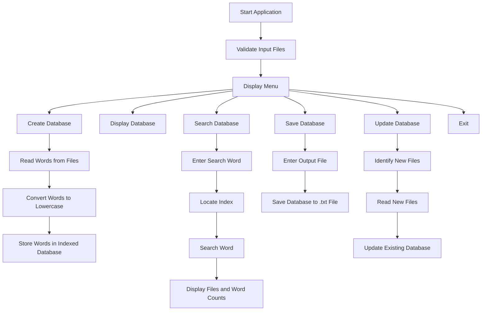

# Inverted Search

## Project Overview

The Inverted Search project is a command-line application that creates and manages an inverted index for multiple text files. Instead of scanning every file each time a word is searched, the application maintains an index that maps each word to the files in which it occurs and records the number of occurrences in each file.

The database is organized using a 26-index structure based on the first character of each word. Main nodes store words and file counts, while sub-nodes store file names and the corresponding word counts.

## Objectives

- To create an inverted index for multiple text files.
- To efficiently search for a word and identify the files containing it.
- To maintain the frequency of each word in individual files.
- To display and save the generated database.
- To update the database with new text files.
- To gain practical experience with linked lists, hashing/indexing concepts, file handling, and dynamic memory allocation.

## Features

### Input File Validation
The application validates command-line input files by checking:
- At least one input file is provided.
- The file has a `.txt` extension.
- The file exists and can be opened.
- The file is not empty.
- Duplicate input file names are not provided.

### Create Database
- Reads words from the input text files.
- Converts alphabetic characters to lowercase.
- Organizes words using a 26-index structure based on the first character.
- Maintains a main node for each unique word.
- Maintains sub-nodes for files containing the word.
- Stores the number of occurrences of each word in each file.

### Display Database
Displays the indexed information including:
- Index
- Word
- File count
- File name
- Word count

### Search Database
- Accepts a word from the user.
- Locates the corresponding index.
- Searches for the word in the database.
- Displays the number of files containing the word.
- Displays each file and its word count.

### Save Database
- Saves the complete database to a user-specified `.txt` file.
- Stores index, word, file count, file name, and word count.

### Update Database
- Creates a list of input files.
- Identifies files that are already present in the database.
- Removes existing files from the update list.
- Processes only new files.
- Adds words from new files to the existing database.

## Technologies and Concepts Used

- C
- Data Structures
- Linked Lists
- Structures
- Dynamic Memory Allocation
- File Handling
- String Handling
- Command-Line Arguments
- Modular Programming
- Indexing / Hash Table Concept

## Data Structure

The project uses three linked-list structures:

### Main Node

Stores a unique word and the number of files containing that word.

```text
MainNode
├── word
├── file_count
├── sub_link
└── main_link
```

### Sub Node

Stores the file name and the number of times the word occurs in that file.

```text
SubNode
├── file_name
├── word_count
└── link
```

### File Node

Maintains a linked list of files used during the database update operation.

```text
FileNode
├── file_name
└── link
```

## Database Organization

The database uses an array of indexes based on the first character of a word.

```text
Index
  |
  +-- a --> words beginning with 'a'
  +-- b --> words beginning with 'b'
  +-- c --> words beginning with 'c'
  ...
  +-- z --> words beginning with 'z'
```

For each word, the main node is connected to sub-nodes containing the files in which the word occurs.

```text
Main Node
[ word | file_count ]
        |
        v
   Sub Node
[ file_name | word_count ]
        |
        v
   Sub Node
[ file_name | word_count ]
```

## Working Flow



## Command-Line Usage

### Compile

```bash
gcc *.c
```

### Run

```bash
./a.out f1.txt f2.txt f3.txt
```

The input text files are provided as command-line arguments.

After starting the application, the following menu is displayed:

```text
1. Create Database
2. Display Database
3. Search Database
4. Save Database
5. Update Database
6. Exit
```

## Project Structure

```text
Inverted-Search/
├── main.c
├── create.c
├── display.c
├── file_list.c
├── save.c
├── search.c
├── update.c
├── validation.c
├── functions.h
├── types.h
├── f1.txt
├── f2.txt
└── f3.txt
```

## Key Challenges and Learnings

- Designed a multi-level linked-list structure to maintain words, files, and word frequencies.
- Implemented indexed database organization based on the first character of each word.
- Learned to process multiple text files and build a common searchable database.
- Implemented validation for file extensions, file existence, empty files, and duplicate input files.
- Implemented search functionality to retrieve file-wise word counts.
- Implemented database saving and updating operations using file handling.
- Gained practical experience in dynamic memory allocation, pointers, structures, and linked-list manipulation.
- Improved understanding of modular programming by dividing the application into multiple source and header files.

## Author

**Chinmayi H K**
