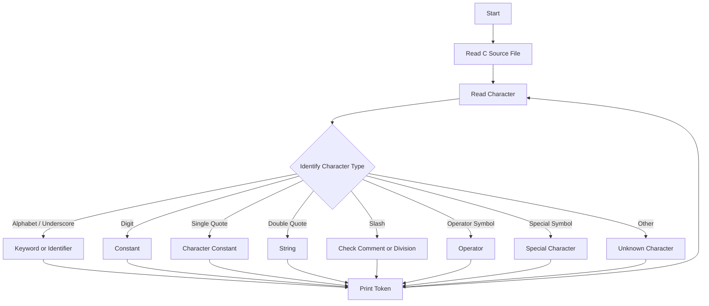

# Lexical Analyser

## Project Overview

The Lexical Analyser is a C-based command-line application that reads a C source file and converts its character stream into a sequence of lexical tokens.

The analyser identifies different elements of C source code such as keywords, identifiers, constants, character constants, strings, operators, special characters, and comments.

## Objectives

- To understand the basic working of a lexical analyser.
- To read and process a C source file character by character.
- To identify different lexical tokens.
- To distinguish keywords from identifiers.
- To recognize constants, strings, character constants, operators, and special characters.
- To handle comments during tokenization.
- To provide basic error handling for unknown characters.

## Features

### Keyword Detection

The analyser maintains a list of C keywords and identifies words such as:

```text
int
char
float
if
else
for
while
return
struct
void
```

### Identifier Detection

The analyser recognizes valid identifiers containing:

- Alphabetic characters
- Digits after the first character
- Underscore

### Constant Detection

The analyser recognizes numeric constants, including decimal values.

### Character Constant Detection

Character constants enclosed within single quotes are identified separately.

Example:

```c
'a'
```

### String Detection

Strings enclosed within double quotes are identified.

Example:

```c
"Hello World"
```

### Comment Handling

The analyser handles:

- Single-line comments `//`
- Multi-line comments `/* ... */`

Comments are skipped during tokenization.

### Operator Detection

The analyser identifies operators such as:

```text
+
-
*
/
%
=
<
>
!
&
|
```

It also recognizes compound operators such as:

```text
++
--
+=
-=
*=
/=
%=
==
!=
<=
>=
&&
||
```

### Special Character Detection

The analyser identifies:

- Parentheses
- Curly brackets
- Square brackets
- Semicolon
- Comma
- Colon

### Unknown Character Detection

Characters that do not belong to the supported token categories are reported as unknown characters.

## Token Categories

The project defines token categories for:

```text
KEYWORD
IDENTIFIER
CONSTANT
OPERATOR
SPECIAL_CHARACTER
```

## Working Flow



## Technologies and Concepts Used

- C
- File I/O Operations
- File Pointers
- Character Processing
- String Operations
- Command-Line Arguments
- Tokenization
- Enumeration
- Modular Programming

## Project Structure

```text
Lexical-Analyser/
├── README.md
├── lexer.c
├── lexer.h
├── main.c
└── sample.c
```

## Command-Line Usage

### Compile

```bash
gcc main.c lexer.c
```

### Run

```bash
./a.out sample.c
```

The program expects exactly one C source file as its command-line argument.

## Sample Output

```text
int -> KEYWORD
main -> IDENTIFIER
( -> OPENING BRACKET
) -> CLOSING BRACKET
{ -> OPENING CURLY BRACKET
return -> KEYWORD
0 -> CONSTANT
; -> SEMICOLON
} -> CLOSING CURLY BRACKET
```

## Key Challenges and Learnings

- Learned how a lexical analyser processes a source file character by character.
- Implemented keyword identification using a keyword table.
- Learned to distinguish identifiers from keywords.
- Implemented recognition of numeric constants, strings, and character constants.
- Implemented handling of single-line and multi-line comments.
- Implemented recognition of single-character and compound operators.
- Gained practical experience with file pointers and `fgetc()`/`ungetc()` based character processing.
- Learned to organize the lexer implementation using separate source and header files.

## Project Outcome

The project demonstrates the basic tokenization stage of a compiler by converting a C source file into identifiable lexical tokens.

## Author

**Chinmayi H K**
