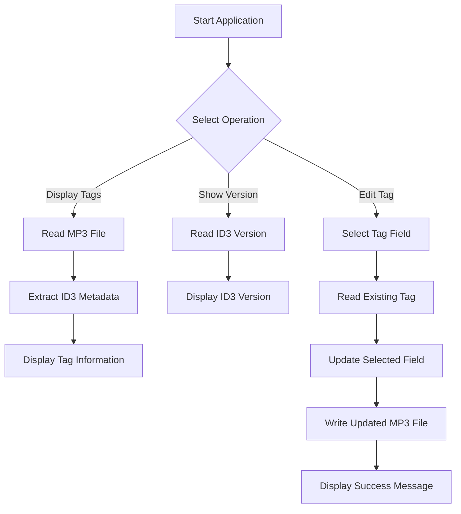

# MP3 Tag Reader

## Project Overview

The MP3 Tag Reader is a command-line application that reads and displays metadata stored in MP3 files. The application supports reading ID3 tag information such as title, artist, album, year, comment, genre, and track information.

The project also includes tag editing functionality, allowing selected MP3 metadata fields to be modified from the command line.

## Objectives

- To understand the structure of MP3 metadata.
- To read and display ID3 tag information.
- To identify the ID3 version of an MP3 file.
- To modify selected MP3 tag fields.
- To gain practical experience with file I/O, binary data handling, strings, and command-line arguments.

## Features

### Display MP3 Tags

The application displays:

- Title
- Artist
- Album
- Year
- Comment
- Genre
- Track
- ID3 version

### Display ID3 Version

The application can display the ID3 version present in the MP3 file.

### Edit MP3 Tags

The following metadata fields can be modified:

| Option | Field |
|---|---|
| `-t` | Title |
| `-a` | Artist |
| `-A` | Album |
| `-y` | Year |
| `-c` | Comment |
| `-g` | Genre |
| `-T` | Track |

## Command-Line Usage

### Display Help

```bash
./mp3tag -h
```

### Display Tags

```bash
./mp3tag filename.mp3
```

### Display ID3 Version

```bash
./mp3tag -v filename.mp3
```

### Edit Title

```bash
./mp3tag -t "My Test Song" filename.mp3
```

### Edit Artist

```bash
./mp3tag -a "Test Artist" filename.mp3
```

### Edit Album

```bash
./mp3tag -A "Test Album" filename.mp3
```

### Edit Year

```bash
./mp3tag -y "2026" filename.mp3
```

### Edit Genre

```bash
./mp3tag -g "Rock" filename.mp3
```

### Edit Track

```bash
./mp3tag -T "5" filename.mp3
```

### Edit Comment

```bash
./mp3tag -c "My Comment" filename.mp3
```

## Working Flow



## Technologies and Concepts Used

- C
- File I/O
- Binary File Handling
- String Operations
- Structures
- Command-Line Arguments
- ID3 Metadata
- Function-based Modular Programming

## Project Structure

```text
MP3-Tag-Reader/
├── README.md
├── main.c
├── mp3tag.c
└── mp3tag.h
```

## Key Challenges and Learnings

- Learned to work with binary MP3 metadata instead of treating the file as ordinary text.
- Understood ID3 tag structures and metadata fields.
- Implemented extraction of tag information from MP3 files.
- Implemented command-line options for different tag operations.
- Implemented tag modification while preserving the MP3 file structure.
- Gained practical experience with file pointers, binary file operations, string handling, and command-line argument processing.
- Learned to handle different ID3 tag formats and invalid/unsupported metadata conditions.

## Project Outcome

The project provides a command-line based solution for reading MP3 metadata and modifying selected tag fields.

## Author

**Chinmayi H K**
